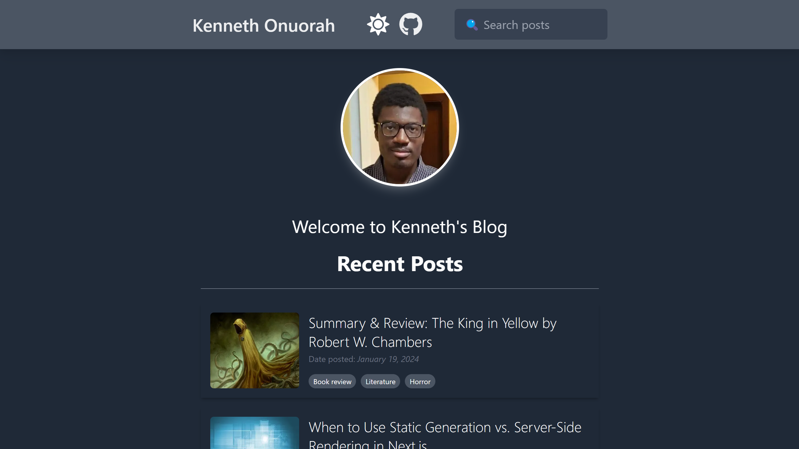
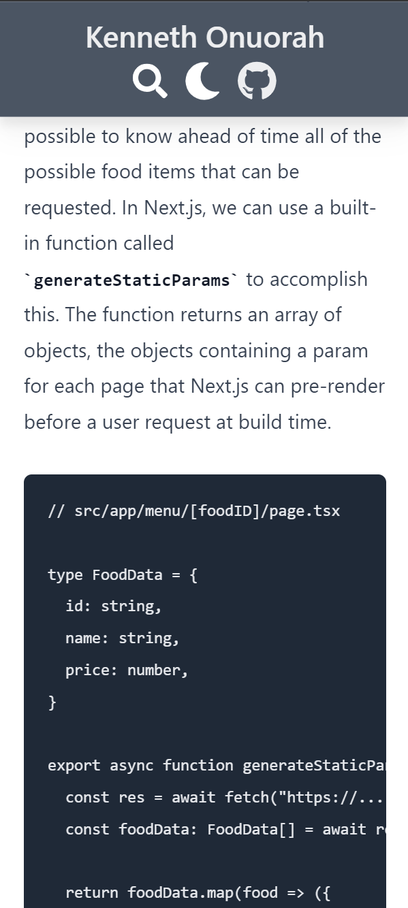

# Blog
## **About the Project**

A blogging web application where users can blog posts in the form of markdown files. Contains searching functionality, 404 handling, and screen responsiveness.

This application uses the [Gray Matter](https://www.npmjs.com/package/gray-matter) for getting front-matter from .md files and [Remark & Remark-HTML](https://www.npmjs.com/package/remark) for processing the markdown content into HTML.

## **Screenshot**
| Desktop | Mobile |
|:---:|:---:|
|  |   |