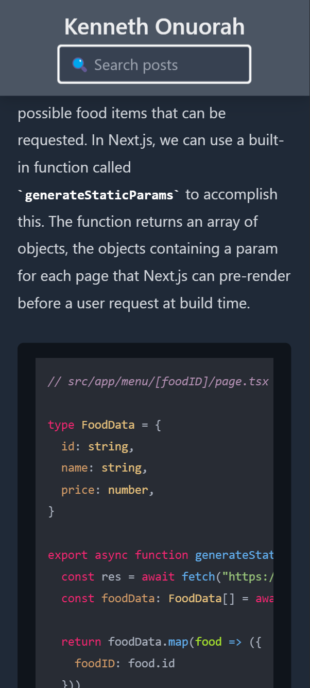

# **Blog**
## **About the Project**

A blogging web application where users can see blog articles I post in the form of prose markdown files. Contains searching functionality, live blog post fetching, theme toggling, and full screen responsiveness.

This application uses the NPM packages [Front Matter](https://www.npmjs.com/package/front-matter), for extracting YAML data from .md files, and [Markdown-To-JSX](https://www.npmjs.com/package/markdown-to-jsx), for processing the markdown content into JSX.

## **Screenshot**
| Desktop | Mobile |
|:---:|:---:|
|  |   |